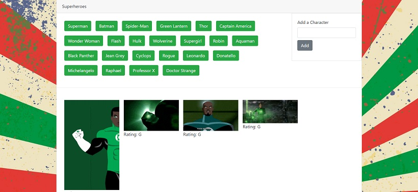

# GifTastic

This application theme is Superheroes. 

How the application works:

* It displays buttons with different superheroes. 
* The user has the option to add a superhero to the list and a new button is added for the new character. 
* When the user clicks on a button, Giphy API is used to retrieve 10 images that is associated with the superhero name.
* When the user clicks on a giphy image, the image is either played or paused depending on the image state.

